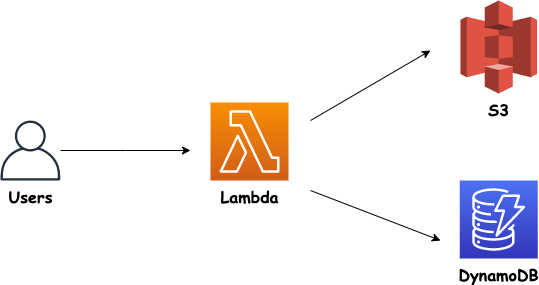

# AWS-for-DevOps-Engineers


  

## Exercises

## IAM

<details>
<summary><b><i>1.Create a User
  
As you probably know at this point, it's not recommended to work with the root account in AWS. For this reason you are going to create a new account which you'll use regularly as the admin account.
  
- Create a user with password credentials
- Add the newly created user to a group called "admin" and attach to it the policy called "Administrator Access"
- Make sure the user has a tag called with the key Role and the value DevOps
  
</i></b></summary>

$\color{green}{\text{Answer}}$

1. Go to the AWS IAM service

2. Click on "Users" in the right side menu (right under "Access Management")

3. Click on the button "Add users"

4. Insert the user name (e.g. mario)

5. Select the credential type: "Password"

6. Set console password to custom and click on "Next"

7. Click on "Add user to group"

8. Insert "admin" as group name

9. Check the "AdministratorAccess" policy and click on "Create group"

10. Click on "Next: Tags"

11. Add a tag with the key Role and the value DevOps

12. Click on "Review" and then create on "Create user"

13. Solution using Terraform
    ```Terraform     
    resource "aws_iam_group_membership" "team" {
      name = "tf-testing-group-membership"

      users = [
        aws_iam_user.newuser.name,

      ]

      group = aws_iam_group.admin.name
    }

    resource "aws_iam_group_policy_attachment" "test-attach" {
      group      = aws_iam_group.admin.name
      policy_arn = "arn:aws:iam::aws:policy/AdministratorAccess"
    }
    resource "aws_iam_group" "admin" {
      name = "admin"
    }

    resource "aws_iam_user" "newuser" {
      name = "newuser"
      path = "/system/"

      tags = {
        Role = "DevOps"
      }
    }
    ```

</details>

<details>
<summary><b><i>2.Password Policy & MFA
  
- Create password policy with the following settings:
- At least minimum 8 characters
- At least one number
- Prevent password reuse
- Then enable MFA for the account.

</i></b></summary>

$\color{green}{\text{Answer}}$

Password Policy:

1. Go to IAM service in AWS

2. Click on "Account settings" under "Access management"

3. Click on "Change password policy"

4. Check "Enforce minimum password length" and set it to 8 characters

5. Check "Require at least one number"

6. Check "Prevent password reuse"

7. Click on "Save changes"

MFA:

1. Click on the account name

2. Click on "My Security Credentials"

3. Expand "Multi-factor authentication (MFA)" and click on "Activate MFA"

4. Choose one of the devices

5. Follow the instructions to set it up and click on "Assign MFA"

6. Solution using Terraform:
   ```Terraform
   resource "aws_iam_account_password_policy" "strict" {
   minimum_password_length        = 8
   require_numbers                = true
   allow_users_to_change_password = true
   password_reuse_prevention      = 1
   }
   ```
   
   Note: You cannot add MFA through terraform, you have to do it in the GUI.

</details>

<details>
<summary><b><i>3.Create a Role
  
Create a basic role to provide EC2 service with Full IAM access permissions. In the end, run from the CLI (or CloudShell) the command to verify the role was created.</i></b></summary>

$\color{green}{\text{Answer}}$

1. Go to AWS console -> IAM

2. Click in the left side menu on "Access Manamgement" -> Roles

3. Click on "Create role"

4. Choose "AWS service" as the type of trusted entity and then choose "EC2" as a use case. Click on "Next"

5. In permissions page, check "IAMFullAccess" and click on "Next" until you get to "Review" page

6. In the "Review" page, give the role a name (e.g. IAMFullAcessEC2), provide a short description and click on "Create role"

7. `aws iam list-roles` will list all the roles in the account, including the one we've just created.

</details>

<details>
<summary><b><i>4.Credential Report
  
- Create/Download a credential report
- Answer the following questions based on the report:
- Are there users with MFA not activated?
- Are there users with password enabled that didn't
- Explain the use case for using the credential report

</i></b></summary>

$\color{green}{\text{Answer}}$

1. Go to the AWS IAM service

2. Under "Access Reports" click on "Credential report"

3. Click on "Download Report" and open it once it's downloaded

4. Answer the questions in this exercises by inspecting the report

Note: The credential report is useful to identify whether there any users who need assistance or attention in regards to their security. For example a user who didn't change his password for a long time and didn't activate MFA.

</details>

<details>
<summary><b><i>5.Access Advisor

Go to the Access Advisor and answer the following questions regarding one of the users:

- Are there services this user never accessed?
- What was the last service the user has accessed?
- What the Access Advisor is used/good for?

</i></b></summary>

$\color{green}{\text{Answer}}$

1. Go to AWS IAM service and click on "Users" under "Access Management"

2. Click on one of the users

3. Click on the "Access Advisor" tab

4. Check which service was last accessed and which was never accessed

Note: Access Advisor can be good to evaluate whether there are services the user is not accessing (as in never or not frequently). This can be help in deciding whether some permissions should be revoked or modified.

</details>

## EC2

<details>
<summary><b><i>6.Launch EC2 Web Instance

Launch one EC2 instance with the following requirements:

- Amazon Linux 2 image
- Instance type: pick up one that has 1 vCPUs and 1 GiB memory
- Instance storage should be deleted upon the termination of the instance
- When the instance starts, it should install:
- Install the httpd package
- Start the httpd service
- Make sure the content of `/var/www/html/index.html` is `I made it! This is is awesome!`
- It should have the tag: "Type: web" and the name of the instance should be "web-1"
- HTTP traffic (port 80) should be accepted from anywhere

</i></b></summary>

$\color{green}{\text{Answer}}$

1. Choose a region close to you

2. Go to EC2 service

3. Click on "Instances" in the menu and click on "Launch instances"

4. Choose image: Amazon Linux 2

5. Choose instance type: t2.micro

6. Make sure "Delete on Termination" is checked in the storage section

7. Under the "User data" field the following:
   ```Linux
   yum update -y
   yum install -y httpd
   systemctl start httpd
   systemctl enable httpd
   echo "<h1>I made it! This is is awesome!</h1>" > /var/www/html/index.html
   ```

8. Add tags with the following keys and values:
   - key `"Type"` and the value `"web"`
   - key `"Name"` and the value `"web-1"`
  
9. In the security group section, add a rule to accept HTTP traffic (TCP) on port 80 from anywhere

10. Click on "Review" and then click on "Launch" after reviewing.

11. If you don't have a key pair, create one and download it.

12. Solution using Terraform:
    ```Terraform
    provider "aws" {
      region = "us-east-1" // Or your desired region
    }

    resource "aws_instance" "web_server" {
      ami           = "ami-12345678" // Replace with the correct AMI for Amazon Linux 2
      instance_type = "t2.micro" // Or any instance type with 1 vCPU and 1 GiB memory

      tags = {
        Name = "web-1"
        Type = "web"
      }

      root_block_device {
        volume_size           = 8 // Or any desired size
        delete_on_termination = true
      }

      provisioner "remote-exec" {
        inline = [
          "sudo yum update -y",
          "sudo yum install -y httpd",
          "sudo systemctl start httpd",
          "sudo bash -c 'echo \"I made it! This is awesome!\" > /var/www/html/index.html'",
          "sudo systemctl enable httpd"
        ]

        connection {
          type        = "ssh"
          user        = "ec2-user"
          private_key = file("~/.ssh/your_private_key.pem") // Replace with the path to your private key
          host        = self.public_ip
        }
      }

      security_group_ids = [aws_security_group.web_sg.id]
      }

    resource "aws_security_group" "web_sg" {
      name        = "web_sg"
      description = "Security group for web server"
  
      ingress {
        from_port   = 80
        to_port     = 80
        protocol    = "tcp"
        cidr_blocks = ["0.0.0.0/0"]
      }
    }
    ```

</details>

<details>
<summary><b><i>7.Security Groups

For this exercise you'll need:
1. EC2 instance with web application
2. Security group inbound rules that allow HTTP traffic

- List the security groups you have in your account, in the region you are using
- Remove the HTTP inbound traffic rule
- Can you still access the application? What do you see/get?
- Add back the rule
- Can you access the application now?

</i></b></summary>

$\color{green}{\text{Answer}}$

Console:

1. Go to EC2 service - > Click on "Security Groups" under "Network & Security" You should see at least one security group. One of them is called "default"\

2. Click on the security group with HTTP rules and click on "Edit inbound rules". Remove the HTTP related rules and click on "Save rules"

3. No. There is a time out because we removed the rule allowing HTTP traffic.

4. Click on the security group -> edit inbound rules and add the following rule:
   - Type: HTTP
   - Port range: 80
   - Source: Anywhere -> 0.0.0.0/0

5. Yes

CLI:

1. `aws ec2 describe-security-groups` -> by default, there is one security group called "default", in a new account

2. Remove the rule:
   ```
   aws ec2 revoke-security-group-ingress \
    --group-name someHTTPSecurityGroup
    --protocol tcp \
    --port 80 \
    --cidr 0.0.0.0/0
   ```

3. No. There is a time out because we removed the rule allowing HTTP traffic.

4. Add the rule we remove:
   ```
   aws ec2 authorize-security-group-ingress \
    --group-name someHTTPSecurityGroup
    --protocol tcp \
    --port 80 \
    --cidr 0.0.0.0/0
   ```

5. Yes

</details>

<details>
<summary><b><i>8.IAM Roles

1. Running EC2 instance without any IAM roles (so you if you connect the instance and try to run AWS commands, it fails)
2. IAM role with "IAMReadOnlyAccess" policy

- Attach a role (and if such role doesn't exists, create it) with "IAMReadOnlyAccess" policy to the EC2 instance
- Verify you can run AWS commands in the instance

</i></b></summary>

$\color{green}{\text{Answer}}$

1. Go to EC2 service

2. Click on the instance to which you would like to attach the IAM role

3. Click on "Actions" -> "Security" -> "Modify IAM Role"

4. Choose the IAM role with "IAMReadOnlyAccess" policy and click on "Save"

5. Running AWS commands now in the instance should work fine (e.g. `aws iam list-users`)

</details>

<details>
<summary><b><i>9.Spot Instances

Create two Spot instances using a Spot Request with the following properties:
   - Amazon Linux 2 AMI
   - 2 instances as target capacity (at any given point of time) while each one has 2 vCPUs and 3 GiB RAM

Create a single Spot instance using Amazon Linux 2 and t2.micro

</i></b></summary>

$\color{green}{\text{Answer}}$

Create Spot Fleets:

1. Go to EC2 service

2. Click on "Spot Requests"

3. Click on "Request Spot Instances" button

4. Set the following values for parameters:
   - Amazon Linux 2 AMI
   - Total target capacity -> 2
   - Check "Maintain target capacity"
   - vCPUs: 2
   - Memory: 3 GiB RAM

5. Click on Launch

Create a single Spot instance:

1. Go to EC2 service

2. Click on "Instances"

3. Click on "Launch Instances"

4. Choose "Amazon Linux 2 AMI" and click on "Next"

5. Choose t2.micro and click on "Next: Configure Instance Details"

6. Select "Request Spot instances"

7. Set Maximum price above current price

8. Click on "Review and Launch"

</details>

<details>
<summary><b><i>10.Elastic IP

An EC2 instance with public IP (not elastic IP)

- Write down the public IP of your EC2 instance somewhere and stop & start the instance. Does the public IP address is the same? why?
- Handle this situation so you have the same public IP even after stopping and starting the instance

</i></b></summary>

$\color{green}{\text{Answer}}$

1. Go to EC2 service -> Instances

2. Write down current public IP address

3. Click on "Instance state" -> Stop instance -> Stop

4. Click on "Instance state" -> Start Instance

5. Yes, the public IP address has changed

6. Let's use an Elastic IP address

7. In EC2 service, under "Network & Security" click on "Elastic IP"

8. Click on the "Allocate elastic IP address" button

9. Make sure you select "Amazon's pool of IPv4 addresses" and click on "Allocate"

10. Click on "Actions" and then "Associate Elastic IP address" 1. Select "instance", choose your instance and provide its private IP address 2. Click on "Associate"

11. Now, if we go back to the instance page, we can see it is using the Elastic IP address as its public IP

Note: to remove it, use "disassociate" option and don't forget to also release it so you won't be billed.

</details>

<details>
<summary><b><i>11.Placement Groups

- Create a placement group. It should be one with a low latency network. Make sure to launch an instance as part of this placement group.
- Create another placement group. This time high availability is a priority

</i></b></summary>

$\color{green}{\text{Answer}}$

Create a placement group:

1. Go to EC2 service

2. Click on "Placement Groups" under "Network & Security"

3. Click on "Create placement group"

4. Give it a name and choose the "Cluster" placement strategy because the requirement is low latency network

5. Click on "Create group"

6. Go to "Instances" and click on "Launch an instance". Choose any properties you would like, just make sure to check "Add instance to placement group" and choose the placement group you've created

Create another placement group:

1. Go to EC2 service

2. Click on "Placement Groups" under "Network & Security"

3. Click on "Create placement group"

4. Give it a name and choose the "Spread" placement strategy because the requirement is high availability as top priority

5. Click on "Create group"

</details>

<details>
<summary><b><i>12.Elastic Network Interfaces

An EC2 instance with network interface

- Create a network interface and attach it to the EC2 instance that already has one network interface
- Explain why would anyone use two network interfaces

</i></b></summary>

$\color{green}{\text{Answer}}$

Create a network inferface:

1. Go to EC2 service

2. Click on "Network Interfaces" under "Network & Security"

3. Click on "Create network interface"

4. Provide a description

5. Choose a subnet (one that is in the AZ as the instance)

6. Optionally attach a security group and click on "Create network interface"

7. Click on "Actions" -> "Attach" and choose the instance to attach it to

8. If you go now to "Instances" page you'll see your instance has two network interfaces

Why two interfaces:

You can move the second network interface between instances. This allows us to create kind of a failover mechanism between the instances.

</details>

<details>
<summary><b><i>13.Hibernate an Instance

- Create an instance that supports hibernation
- Hibernate the instance
- Start the instance
- What way is there to prove that instance was hibernated from OS perspective?

</i></b></summary>

$\color{green}{\text{Answer}}$

1. Create an instance that supports hibernation

2. Go to EC2 service

3. Go to instances and create an instance

4. In "Configure instance" make sure to check "Enable hibernation as an additional stop behavior"

5. In "Add storage", make sure to encrypt EBS and make sure the size > instance RAM size (because hibernation saves the RAM state)

6. Review and Launch

7. Hibernate the instance

8. Go to the instance page

9. Click on "Instance state" -> "Hibernate instance" -> Hibernate

10. Instance state -> Start

11. Run the "uptime" command, which will display the amount of time the system was up

</details>

<details>
<summary><b><i>14.EBS Volume Creation

One EC2 instance that you can get rid of

- Create a volume in the same AZ as your instance, with the following properties:
  - gp2 volume type
  - 4 GiB size
- Once created, attach it to your EC2 instance
- Remove your EC2 instance. What happened to the EBS volumes attached to the EC2 instance?

</i></b></summary>

$\color{green}{\text{Answer}}$

1. Go to EC2 service

2. Click on "Volumes" under "Elastic Block Store"

3. Click on "Create Volume"
4. Select the following properties

5. gp2 volume type

6. 4 GiB size

7. The same AZ as your instance

8. Click on "Create volume"

9. Right click on the volume you've just created -> attach volume -> choose your EC2 instance and click on "Attach"

10. Terminate your instance

11. The default EBS volume (created when you launched the instance for the first time) will be deleted (unless you didn't check "Delete on termination"), but the volume you've created as part of this exercise, will remain

Note: don't forget to remove the EBS volume you've created in this exercise

</details>

<details>
<summary><b><i>15.EBS Snapshots

EBS Volume

- Create a snapshot of an EBS volume
- Verify the snapshot was created
- Move the data to another region
- Create a volume out of it in a different AZ

</i></b></summary>

$\color{green}{\text{Answer}}$

Create a snapshot:

1. Go to EC2 service

2. Click on "Volumes" under "Elastic Block Store"

3. Right click on the chosen volume -> Create snapshot

4. Insert a description and click on "Create Snapshot"

Verify the snapshot:

1. Click on "Snapshots" under "Elastic Block Store"

2. You should see the snapshot you've created

Move the data:

1. Select the snapshot and click on Actions -> Copy

2. Select a region to where the snapshot will be copied

Create a volume:

1. Select the snapshot and click on Actions -> Create volume

2. Choose a different AZ

3. Click on "Create Volume"

</details>

<details>
<summary><b><i>16.Create an AMI

One running EC2 instance

- Make some changes in the operating system of your instance (create files, modify files, ...)
- Create an AMI image from running EC2 instance
- Launch a new instance using the custom AMI you've created

</i></b></summary>

$\color{green}{\text{Answer}}$

1. Connect to your EC2 instance (ssh, console, ...)

2. Make some changes in the operating system

3. Go to EC2 service

4. Right click on the instance where you made some changes -> Image and templates -> Create image

5. Give the image a name and click on "Create image"

6. Launch new instance and choose the image you've just created

</details>

<details>
<summary><b><i>17.Create EFS

Two EC2 instances in different availability zones

- Create an EFS with the following properties
- Set lifecycle management to 60 days
- The mode should match a use case of scaling to high levels of throughput and I/O operations per second
- Mount the EFS in both of your EC2 instances

</i></b></summary>

$\color{green}{\text{Answer}}$

1. Go to EFS console

2. Click on "Create file system"

3. Create on "customize"

4. Set lifecycle management to "60 days since last access"

5. Set Performance mode to "MAX I/O" due to the requirement of "Scaling to high levels of throughput"

6. Click on "Next"

7. Choose security group to attach (if you don't have any, create one and make sure it has a rule to allow NFS traffic) and click on "Next" until you are able to review and create it

8. SSH into your EC2 instances

9. Run `sudo yum install -y amazon-efs-utils`

10. Run `mkdir efs`

11. If you go to your EFS page and click on "Attach", you can see what ways are there to mount your EFS on your instancess

12. The command to mount the EFS should be similar to `sudo mount -t efs -o tls <EFS name>:/ efs` - copy and paste it in your ec2 instance's OS

</details>

## S3

<details>
<summary><b><i>18.Create buckets

Create the following buckets:

Private bucket
  - eu-west-2 region
  - Upload a single file to the bucket. Any file.

Public bucket
  - eu-west-1 region
  - Versioning should be enabled

</i></b></summary>

$\color{green}{\text{Answer}}$

For the first bucket:

1. Go to S3 service in the AWS console. If not in buckets page, click on "buckets" in the left side menu

2. Click on "Create bucket"

3. Give a globally unique name for your bucket

4. Choose the region "eu-west-2"

5. Click on "Create bucket"

6. Click on the bucket name

7. Under "objects" click on "Upload" -> "Add files" -> Choose file to upload -> Click on "Upload"

8. For the second bucket:

Go to S3 service in the AWS console. If not in buckets page, click on "buckets" in the left side menu

1. Click on "Create bucket"

2. Give a globally unique name for your bucket

3. Choose the region "eu-west-1"

4. Make sure to uncheck the box for "Private bucket" to make it public

5. Make sure to check the enable box for "Bucket Versioning"

6. Click on "Create bucket"

Solution using Terraform:
```Terraform
resource "aws_s3_bucket" "private_bucket" {
  bucket = "my-first-private-bucket"
  region = "eu-west-2"
  acl = "private" 

  tags = {
    Name        = "My First Private Bucket"
    Environment = "Exercise"
  }
}

resource "aws_s3_bucket_acl" "private_bucket_acl" {
  bucket = aws_s3_bucket.private_bucket.id
  acl    = "private"
}

resource "aws_s3_bucket" "public_bucket" {
  bucket = "my-first-public-bucket"
  region = "eu-west-1"

  tags = {
    Name        = "My First Public Bucket"
    Environment = "Exercise"
  }

  versioning {
    enabled = true
  }
}

resource "aws_s3_bucket_acl" "public_bucket_acl" {
  bucket = aws_s3_bucket.public_bucket.id
  acl    = "public-read"
}

resource "aws_s3_bucket_object" "bucket_object" {
  bucket   = "my-first-private-bucket"
  key      = "some_object_key"
  content  = "object content"
}
```

</details>

## ELB

<details>
<summary><b><i>19.Application Load Balancer

Two EC2 instances with a simple web application that shows the web page with the string "Hey, it's a me, `<HOSTNAME>!`"

Create an application load balancer for the two instances you have, with the following properties:
  - healthy threshold: 3
  - unhealthy threshold: 3
  - interval: 10 seconds

Verify load balancer is working (= you get reply from both instances at different times)

</i></b></summary>

$\color{green}{\text{Answer}}$

1. Go to EC2 service

2. Click in the left side menu on "Load balancers" under "Load balancing"

3. Click on "Create load balancer"

4. Choose "Application Load Balancer"

5. Insert a name for the LB

6. Choose an AZ where you want the LB to operate

7. Choose a security group

8. Under "Listeners and routing" click on "Create target group" and choose "Instances"

9. Provide a name for the target group

10. Set healthy threshold to 3

11. Set unhealthy threshold to 3

12. Set interval to 10 seconds

13. Click on "Next" and choose the two of the instances you've created

14. Click on "Create target group"

15. Refresh target groups and choose the one you've just created

16. Click on "Create load balancer" and wait for it to be provisioned

17. Copy DNS address and paste it in the browser. If you refresh, you should see different message based on the instance where the traffic was routed to

</details>

<details>
<summary><b><i>20.ALB Multiple Target Groups

Two EC2 instances with a simple web application that shows the web page with the string "Hey, it's a me, `<HOSTNAME>`!" One EC2 instance with a simple web application that shows the web page with the string "Hey, it's only a test..." under the endpoint /test

Create an application load balancer for the two instances you have, with the following properties:
  - healthy threshold: 3
  - unhealthy threshold: 3
  - interval: 10 seconds

Create another target group for the third instance
Traffic should be forwarded to this group based on the "/test" path

</i></b></summary>

$\color{green}{\text{Answer}}$

1. Go to EC2 service

2. Click in the left side menu on "Load balancers" under "Load balancing"

3. Click on "Create load balancer"

4. Choose "Application Load Balancer"

5. Insert a name for the LB

6. Choose an AZ where you want the LB to operate

7. Choose a security group

8. Under "Listeners and routing" click on "Create target group" and choose "Instances"

9. Provide a name for the target group

10. Set healthy threshold to 3

11. Set unhealthy threshold to 3

12. Set interval to 10 seconds

13. Click on "Next" and choose two out of three instances you've created

14. Click on "Create target group"

15. Refresh target groups and choose the one you've just created

16. Click on "Create load balancer" and wait for it to be provisioned

17. In the left side menu click on "Target Groups" under "Load Balancing"

18. Click on "Create target group"

19. Set it with the same properties as previous target group but this time, add the third instance that you didn't include in the previous target group

20. Go back to your ALB and under "Listeners" click on "Edit rules" under your current listener

21. Add a rule where if the path is "/test" then traffic should be forwarded to the second target group you've created

22. Click on "Save"

23. Test it by going to the browser, insert the address and add "/test" to the address

</details>

<details>
<summary><b><i>21.Network Load Balancer

Two running EC2 instances

Create a network load balancer:
  - healthy threshold: 3
  - unhealthy threshold: 3
  - interval: 10 seconds

Listener should be using TCP protocol on port 80

</i></b></summary>

$\color{green}{\text{Answer}}$

1. Go to EC2 service

2. Click in the left side menu on "Load balancers" under "Load balancing"

3. Click on "Create load balancer"

4. Choose "Network Load Balancer"

5. Insert a name for the LB

6. Choose AZs where you want the LB to operate

7. Choose a security group

8. Under "Listeners and routing" click on "Create target group" and choose "Instances"

9. Provide a name for the target group

10. Set healthy threshold to 3

11. Set unhealthy threshold to 3

12. Set interval to 10 seconds

13. Set protocol to TCP and port to 80

14. Click on "Next" and choose two instances you have

15. Click on "Create target group"

16. Refresh target groups and choose the one you've just created

17. Click on "Create load balancer" and wait for it to be provisioned

</details>

## Auto Scaling Groups

<details>
<summary><b><i>22.Basics

Zero EC2 instances running

Create a scaling group for web servers with the following properties:
  - Amazon Linux 2 AMI
  - t2.micro as the instance type
  - user data:
    ```
    yum install -y httpd
    systemctl start httpd
    systemctl enable httpd
    ```

Were new instances created since you created the auto scaling group? How many? Why? 

Change desired capacity to 2. Did it launch more instances?

Change back the desired capacity to 1. What is the result of this action?

</i></b></summary>

$\color{green}{\text{Answer}}$

Create a scaling group:

1. Go to EC2 service

2. Click on "Auto Scaling Groups" under "Auto Scaling"

3. Click on "Create Auto Scaling Group"

4. Insert a name

5. Click on "Create a launch template"

6. Insert a name and a version for the template

7. Select an AMI to use (Amazon Linux 2)

8. Select t2.micro instance type

9. Select a key pair

10. Attach a security group

11. Under "Advanced" insert the user data

12. Click on "Create"

13. Choose the launch template you've just created and click on "Next"

14. Choose "Adhere to launch template"

15. Choose in which AZs to launch and click on "Next"

16. Link it to ALB (if you don't have one, create it)

17. Mark ELB health check in addition to EC2. Click on "Next" until you reach the review page and click on "Create auto scaling group"

One instance was launched to met the criteria of the auto scaling group we've created. The reason it launched only one is due to "Desired capacity" set to 1. 

Change it by going to your auto scaling group -> Details -> Edit -> "2 desired capacity". This should create another instance if only one is running 

Reducing desired capacity back to 1 will terminate one of the instances (assuming 2 are running).

</details>

<details>
<summary><b><i>23.Dynamic Scaling Policy

Existing Auto Scaling Group with maximum capacity set to at least 3

One running EC2 instance with max of 4 CPUs

Create a dynamic scaling policy with the following properties:
  - Track average CPU utilization
  - Target value should be 70%
  - Increase the CPU utilization to at least 70%
    
Do you see change in number of instances?

Decrease CPU utilization to less than 70%

Do you see change in number of instances?

</i></b></summary>

$\color{green}{\text{Answer}}$

1. Go to EC2 service -> Auto Scaling Groups and click on the tab "Automating scaling"

2. Choose "Target tracking scaling" under "Policy Type"

3. Set metric type to Average CPU utilization

4. Set target value to 70% and click on "Create"

5. If you are using Amazon Linux 2, you can stress the instance with the following:
   ```
   sudo amazon-linux-extras install epel -y
   sudo yum install stress -y
   stress -c 4  # assuming you have 4 CPUs
   ```

Yes, additional EC2 instance was added

Simply stop the stress command

Yes, one of the EC2 instances was terminated

</details>

## VPC

<details>
<summary><b><i>24.My First VPC

Create a new VPC:
  - It should have a CIDR that supports using at least 60,000 hosts
  - It should be named "exercise-vpc"

</i></b></summary>

$\color{green}{\text{Answer}}$

1. Under "Virtual Private Cloud" click on "Your VPCs"

2. Click on "Create VPC"

3. Insert a name - "exercise-vpc"

4. Insert IPv4 CIDR block: 10.0.0.0/16

5. Keep "Tenancy" at Default

6. Click on "Create VPC"

Solution using Terraform:
```Terraform
resource "aws_vpc" "exercise-vpc" {
  cidr_block       = "10.0.0.0/16"

  tags = {
    Name = "exercise-vpc"
  }
}

output "vpc-id" {
  value = aws_vpc.exercise-vpc.id
}
```

</details>

<details>
<summary><b><i>25.Subnets

Single newly created VPC

Region with more than two availability zones

Create a subnet in your newly created VPC:
  - CIDR: 10.0.0.0/24
  - Name: NewSubnet1

Create additional subnet:
  - CIDR: 10.0.1.0/24
  - Name: NewSubnet2
  - Different AZ compared to previous subnet

Create additional subnet:
  - CIDR: 10.0.2.0/24
  - Name: NewSubnet3
  - Different AZ compared to previous subnet

</i></b></summary>

$\color{green}{\text{Answer}}$

1. Click on "Subnets" under "Virtual Private Cloud"

2. Make sure you filter by your newly created VPC (to not see the subnets in all other VPCs). You can do this in the left side menu

3. Click on "Create subnet"

4. Choose your newly created VPC

5. Set the subnet name to "NewSubnet1"

6. Choose AZ

7. Set CIDR to 10.0.0.0/24

8. Click on "Add new subnet"

9. Set the subnet name to "NewSubnet2"

10. Choose a different AZ

11. Set CIDR to 10.0.1.0/24

12. Click on "Add new subnet"

13. Set the subnet name to "NewSubnet3"

14. Choose a different AZ

15. Set CIDR to 10.0.2.0/24

Solution using Terraform
```Terraform
# Variables

variable "vpc_id" {
  type = string
}

# AWS Subnets

resource "aws_subnet" "NewSubnet1" {
  cidr_block = "10.0.0.0/24"
  vpc_id = var.vpc_id
  availability_zone = data.aws_availability_zones.all.names[0]
  tags = {
    Purpose: exercise
    Name: "NewSubnet1"
  }
}

resource "aws_subnet" "NewSubnet2" {
  cidr_block = "10.0.1.0/24"
  vpc_id = var.vpc_id
  availability_zone = data.aws_availability_zones.all.names[1]
  tags = {
    Purpose: exercise
    Name: "NewSubnet2"
  }
}

resource "aws_subnet" "NewSubnet3" {
  cidr_block = "10.0.2.0/24"
  vpc_id = var.vpc_id
  availability_zone = data.aws_availability_zones.all.names[2]
  tags = {
    Purpose: exercise
    Name: "NewSubnet3"
  }
}

# Outputs

output "NewSubnet1-id" {
  value = aws_subnet.NewSubnet1.id
}
output "NewSubnet2-id" {
  value = aws_subnet.NewSubnet2.id
}
output "NewSubnet3-id" {
  value = aws_subnet.NewSubnet3.id
}
```

</details>

## Databases

<details>
<summary><b><i>26.MySQL DB

Create a MySQL database with the following properties:
  - Instance type: db.t2.micro
  - gp2 storage
  - Storage Auto scaling should be enabled and threshold should be set to 500 GiB
  - Public access should be enabled
  - Port should be set to 3306
  - DB name: 'db'
  - Backup retention: 10 days

Create read replica for the database you've created

</i></b></summary>

$\color{green}{\text{Answer}}$

1. Go to RDS service

2. Click on "Databases" in the left side menu and click on the "Create database" button

3. Choose "standard create"

4. Choose "MySQL" and the recommended version

5. Choose "Production" template

6. Specify DB instance identifier

7. Specify Credentials (master username and password)

8. Choose DB instance type: Burstable classes, db.t2.micro

9. Choose "gp2" as storage

10. Enable storage autoscalling: maximum storage threshold of 500 GiB

11. Choose "Do not create a standby instance"

12. Choose a default VPC and subnet

13. Check "Yes" for public access

14. Choose "No preference" for AZ

15. Database port should be 3306

16. For authentication, choose "Password and IAM database authentication"

17. Set initial database name as "db"

18. Increase backup retention period to 10 days

19. Click on "Create database" button

20. Go to the database under "Databases" in the left side menu

21. Click on "Actions" -> Create read replica

22. Click on "Create read replica"

</details>

<details>
<summary><b><i>27.Aurora DB
  
Create an Aurora database with the following properties:
  - Edition: MySQL
  - Instance type: db.t3.small
  - A reader node in a different AZ
  - Public access should be enabled
  - Port should be set to 3306
  - DB name: 'db'
  - Backup retention: 10 days

How many instances does your DB cluster has?

</i></b></summary>

$\color{green}{\text{Answer}}$

1. Go to RDS service

2. Click on "Databases" in the left side menu and click on the "Create database" button

3. Choose "standard create"

4. Choose "Aurora DB"

5. Choose "MySQL" edition and "Provisioned" as capacity type

6. Choose "single-master"

7. Specify Credentials (master username and password)

8. Choose DB instance type: Burstable classes, db.t3.small

9. Choose "Create an Aurora Replica or Reader node in a different AZ"

10. Choose a default VPC and subnet

11. Check "Yes" for public access

12. Database port should be 3306

13. For authentication, choose "Password and IAM database authentication"

14. Set initial database name as "db"

15. Increase backup retention period to 10 days

16. Click on "Create database" button

17. Two instances - one reader and one writer

</details>

<details>
<summary><b><i>28.ElastiCache

Create ElastiCache Redis:
  - Instance type should be "cache.t2.micro"
  - Replicas should be 0

</i></b></summary>

$\color{green}{\text{Answer}}$

1. Go to ElastiCache service

2. Click on "Get Started Now"

3. Choose "Redis"

4. Insert a name and description

5. Choose "cache.t2.micro" an node type

6. Set number of replicas to 0

7. Create new subnet group

8. Click on "Create"

</details>

## DNS

<details>
<summary><b><i>28.Register Domain

Note: registering domain costs money. Don't do this exercise, unless you understand that you are going to register a domain and it's going to cost you money.

- Register your own custom domain using AWS Route 53
- What is the type of your domain?
- How many records your domain has?

</i></b></summary>

$\color{green}{\text{Answer}}$

1. Go to Route 53 service page

2. Click in the menu on "Registered Domains" under "Domains"

3. Click on "Register Domain"

4. Insert your domain

5. Check if it's available. If it is, add it to the cart

Note: registering domain costs money. Don't click on "continue", unless you understand that you are going to register a domain and it's going to cost you money.

6. Click on "Continue" and fill in your contact information

7. Choose if you want to renew it in the future automatically. Accept the terms and click on "Complete Order"

8. Go to hosted zones and you should see there your newly registered domain

9. The domain type is "Public"

10. The domain has 2 DNS records: NS and SOA

</details>

<details>
<summary><b><i>29.Creating Records

At least one registered domain

Create the following record for your domain:
  - Record name: foo
  - Record type: A
  - Set some IP in the value field

Verify from the shell that you are able to use the record you've created to lookup for the IP address by using the domain name

</i></b></summary>

$\color{green}{\text{Answer}}$

1. Go to Route 53 service -> Hosted zones

2. Click on your domain name

3. Click on "Create record"

4. Insert "foo" in "Record name"

5. Set "Record type" to A

6. In "Value" insert "201.7.20.22"

7. Click on "Create records"

8. In your shell, type `nslookup foo.<YOUR DOMAIN>` or `dig foo.<YOUR NAME>`

</details>

<details>
<summary><b><i>30.Health Checks

3 web instances in different AZs.

For each instance create a health checks with the following properties:
  - Name it after the AZ where the instance resides
  - Failure threshold should be 5
  - Edit the security group of one of your instances and remove HTTP rules.

Did it change the status of the health check?

</i></b></summary>

$\color{green}{\text{Answer}}$

1. Go to Route 53

2. Click on "Health Checks" in the left-side menu

3. Click on "Create health check"

4. Insert the name: us-east-2

5. What to monitor: endpoint

6. Insert the IP address of the instance

7. Insert the endpoint /health if your web instance supports that endpoint

8. In advanced configuration, set Failure threshold to 5

9. Click on "next" and then on "Create health check"

10. Repeat steps 1-9 for the other two instances you have

11. Go to security group of one of your instances

12. Click on "Actions" -> Edit inbound rules -> Delete HTTP based rules

13. Go back to health checks page and after a couple of seconds you should see that the status becomes "unhealthy"

</details>

<details>
<summary><b><i>31.Failover

A running EC2 web instance with an health check defined for it in Route 53

- Create a failover record that will failover to another record if an health check isn't passing
- Make sure TTL is 30
- Associate the failover record with the health check you have

</i></b></summary>

$\color{green}{\text{Answer}}$

1. Go to Route 53 service

2. Click on "Hosted Zones" in the left-side menu

3. Click on your hosted zone

4. Click on "Created record"

5. Insert "failover" in record name and set record type to A

6. Insert the IP of your instance

7. Set the routing policy to failover

8. Set TTL to 30

9. Associate with an health check

10. Add another record with the same properties as the previous one

11. Click on "Create records"

12. Go to your EC2 instance and edit its security group to remove the HTTP rules

13. Use your web app and if you print the hotsname of your instance then you will notice, a failover was performed and a different EC2 instance is used

</details>

## Containers

<details>
<summary><b><i>32.Run Tasks

Note: This costs money

- Create a task in ECS to launch in Fargate.
- The task itself can be a sample app.

</i></b></summary>

$\color{green}{\text{Answer}}$

1. Go to Elastic Container Service page

2. Click on "Get Started"

3. Choose "sample-app"

4. Verify it's using Farget and not ECS (EC2 Instance) and click on "Next"

5. Select "None" in Load balancer type and click on "Next"

6. Insert cluster name (e.g. my_cluster) and click on "Next"

7. Review everything and click on "Create"

8. Wait for everything to complete

9. Go to clusters page and check the status of the task (it will take a couple of seconds/minutes before changing to "Running")

10. Click on the task and you'll see the launch type is Fargate

</details>

## Lambda

<details>
<summary><b><i>33.Hello Function

Create a basic AWS Lambda function that when given a name, will return "Hello "

</i></b></summary>

$\color{green}{\text{Answer}}$

Define a function:

1. Go to Lambda console panel and click on Create function

2. Give the function a name like BasicFunction

3. Select Python3 runtime

4. Now to handle function's permissions, we can attach IAM role to our function either by setting a role or creating a new role. I selected "Create a new role from AWS policy templates"

5. In "Policy Templates" select "Simple Microservice Permissions"

6. Next, you should see a text editor where you will insert a code similar to the following:
   ```JSON
   import json

   def lambda_handler(event, context):
     firstName = event['name']
     return 'Hello ' + firstName
   ```

7. Click on "Create Function"

Define a test:

1. Now let's test the function. Click on "Test".

2. Select "Create new test event"

3. Set the "Event name" to whatever you'd like. For example "TestEvent"

4. Provide keys to test
   ```
   {
     "name": 'Spyro'
   }
   ```

5. Click on "Create"

Test the function:

1. Choose the test event you've create (`TestEvent`)

2. Click on the `Test` button

3. You should see something similar to `Execution result: succeeded`

4. If you'll go to AWS CloudWatch, you should see a related log stream

</details>

<details>
<summary><b><i>34.URL

Create a basic AWS Lambda function that will be triggered when you enter a URL in the browser

</i></b></summary>

$\color{green}{\text{Answer}}$

Define a function:

1. Go to Lambda console panel and click on Create function

2. Give the function a name like urlFunction

3. Select Python3 runtime

4. Now to handle function's permissions, we can attach IAM role to our function either by setting a role or creating a new role. I selected "Create a new role from AWS policy templates"

5. In "Policy Templates" select "Simple Microservice Permissions"

6. Next, you should see a text editor where you will insert a code similar to the following:
   ```JSON
   import json

   def lambda_handler(event, context):
     firstName = event['name']
     return 'Hello ' + firstName
   ```

7. Click on "Create Function"

Define the test:

1. Now let's test the function. Click on "Test".

2. Select "Create new test event"

3. Set the "Event name" to whatever you'd like. For example "TestEvent"

4. Provide keys to test
   ```
   {
     "name": 'Spyro'
   }
   ```

5. Click on "Create"

Test the function:

1. Choose the test event you've create (`TestEvent`)

2. Click on the Test button

3. You should see something similar to `Execution result: succeeded`

4. If you'll go to AWS CloudWatch, you should see a related log stream

Define a trigger:

We'll define a trigger in order to trigger the function when inserting the URL in the browser

1. Go to "API Gateway console" and click on "New API Option"

2. Insert the API name, description and click on "Create"

3. Click on Action -> Create Resource

4. Insert resource name and path (e.g. the path can be /hello) and click on "Create Resource"

5. Select the resource we've created and click on "Create Method"

6. For "integration type" choose "Lambda Function" and insert the lambda function name we've given to the function we previously created. Make sure to also use the same region

7. Confirm settings and any required permissions

8. Now click again on the resource and modify "Body Mapping Templates" so the template includes this:
   ```
   { "name": "$input.params('name')" }
   ```

9. Finally save and click on Actions -> Deploy API

Running the function:

1. In the API Gateway console, in stages menu, select the API we've created and click on the GET option

2. You'll see an invoke URL you can click on. You might have to modify it to include the input so it looks similar to this: `.../hello?name=mario`

3. You should see in your browser `Hello Mario`

</details>

## Elastic Beanstalk

<details>
<summary><b><i>35.Node.js

Make sure the node.js application has a npm start command specified in the package.json file like the following example:
```JSON
{

  "name": "application-name",
  "version": "0.0.1",
  "private": true,
  "scripts": {
    "start": "node app"
  },
  "dependencies": {
    "express": "3.1.0",
    "jade": "*",
    "mysql": "*",
    "async": "*",
    "node-uuid": "*"
} 
```

Zip the application, and make sure to not zip the parent folder, only the files together, like:
```
\Parent - (exclude the folder itself from the the zip)
- file1 - (include in zip)
- subfolder1 (include in zip)
- file2 (include in zip)
- file3 (include in zip)
```

</i></b></summary>

$\color{green}{\text{Answer}}$

1. Create a "New Environment"

2. Select Environment => Web Server Environment

3. Fill the Create a web server environment section a. Fill the "Application Name"

4. Fill the Environment information section a. Fill the "Environment Name" b. Domain - "Leave for autogenerated value"

5. Platform a. Choose Platform => node.js

6. Application Code => upload the Zipped Code from your local computer

7. Create Environment

8. Wait for the environment to come up

9. Check the website a. Navigate to the Applications tab, b. select the recently created node.js app c. click on the URL - highlighted

</details>

## CodePipeline

<details>
<summary><b><i>36.Basic CI with S3

- Create a new S3 bucket
- Add to the bucket index.html file and make it a static website
- Create a GitHub repo and put the index.html there
- Make sure to connect your AWS account to GitHub
- Create a CI pipeline in AWS to publish the updated index.html from GitHub every time someone makes a change to the repo, to a specific branch

</i></b></summary>

$\color{green}{\text{Answer}}$

Create S3 bucket:

1. Go to S3 service in AWS console

2. Insert bucket name and choose region

3. Uncheck "block public access" to make it public

4. Click on "Create bucket"

Static website hosting:

1. Navigate to the newly created bucket and click on "properties" tab

2. Click on "Edit" in "Static Website Hosting" section

3. Check "Enable" for "Static web hosting"

4. Set "index.html" as index document and "error.html" as error document.

S3 bucket permissions:

1. Click on "Permissions" tab in the newly created S3 bucket

2. Click on Bucket Policy -> Edit -> Policy Generator. Click on "Generate Policy" for "GetObject"

3. Copy the generated policy and go to Permissions tab and replace it with the current policy

GitHub Source:

1. Go to Developers Tools Console and create a new connection (GitHub)

Create a CI pipeline:

1. Go to CodePipeline in AWS console

2. Click on "Create Pipeline" -> Insert a pipeline name -> Click on Next

3. Choose the newly created source (GitHub) under sources

4. Select repository name and branch name

5. Select "AWS CodeBuild" as build provider

6. Select "Managed Image", "standard" runtime and "new service role"

7. In deploy stage choose the newly created S3 bucket and for deploy provider choose "Amazon S3"

8. Review the pipeline and click on "Create pipeline"

Test the pipeline:

1. Clone the project from GitHub

2. Make changes to index.html and commit them (git commit -a)

3. Push the new change, verify that the newly created AWS pipeline was triggered and check the content of the site

</details>

## CDK

<details>
<summary><b><i>37.Set up a CDK Project

Initialize a CDK project and set up files required to build a CDK project.

</i></b></summary>

$\color{green}{\text{Answer}}$

Initialize a CDK project:

1. Install CDK on your machine by running `npm install -g aws-cdk`.

2. Create a new directory named `sample` for your project and run `cdk init app --language typescript` to initialize a CDK project. You can choose language as csharp, fsharp, go, java, javascript, python or typescript.

3. You would see the following files created in your directory:
   - `cdk.json`, `tsconfig.json`, `package.json` - These are configuration files that are used to define some global settings for your CDK project.
   - `bin/sample.ts` - This is the entry point for your CDK project. This file is used to define the stack that you want to create.
   - `lib/sample-stack.ts` - This is the main file that will contain the code for your CDK project.
  
Create a Sample lambda function:

1. In `lib/sample-stack.ts file`, add the following code to create a lambda function:
   ```TypeScript
   import * as cdk from 'aws-cdk-lib';
   import * as lambda from 'aws-cdk-lib/aws-lambda';
   import { Construct } from 'constructs';

   export class SampleStack extends cdk.Stack {
     constructor(scope: Construct, id: string, props?: cdk.StackProps) {
       super(scope, id, props);

       const hello = new lambda.Function(this, 'SampleLambda', {
         runtime: lambda.Runtime.NODEJS_14_X,
         code: lambda.Code.fromInline('exports.handler = async () => "hello world";'),
         handler: 'index.handler'
       });
     }
   }
   ```

This will create a sample lambda function that returns "hello world" when invoked.

Bootstrap the CDK project:

Before you deploy your project. You need to bootstrap your project. This will create a CloudFormation stack that will be used to deploy your project. You can bootstrap your project by running `cdk bootstrap`.

Deploy the Project:

1. Run `npm install` to install all the dependencies for your project whenever you make changes.

2. Run `cdk synth` to synthesize the CloudFormation template for your project. You will see a new file called `cdk.out/CDKToolkit.template.json` that contains the CloudFormation template for your project.

3. Run `cdk diff` to see the changes that will be made to your AWS account. You will see a new stack called `SampleStack` that will create a lambda function and all the changes associated with it.

4. Run `cdk deploy` to deploy your project. You should see a new stack called created in your AWS account under CloudFormation.

5. Go to Lambda console and you will see a new lambda function called `SampleLambda` created in your account.

</details>

## Misc

<details>
<summary><b><i>38.Budget Setup

Setup a cost budget in your AWS account based on your needs.

</i></b></summary>

$\color{green}{\text{Answer}}$

1. Go to "Billing"

2. Click on "Budgets" in the menu

3. Click on "Create a budget"

4. Choose "Cost Budget" and click on "Next"

5. Choose the values that work for you. For example, recurring monthly budget with a specific amount

6. Insert a budget name and Click on "Next"

7. Set up an alert but clicking on "Add an alert threshold"

8. Set a threshold (e.g. 75% of budgeted amount)

9. Set an email where a notification will be sent

10. Click on "Next" until you can click on "Create a budget"

</details>

<details>
<summary><b><i>39.No Application

Explain what might be possible reasons for the following issues:
  - Getting "time out" when trying to reach an application running on EC2 instance
  - Getting "connection refused" error

</i></b></summary>

$\color{green}{\text{Answer}}$

'Time out' Can be due to one of the following:
  - Security group doesn't allow access
  - No host (yes, I know. Not the first thing to check and yet...)
  - Operating system firewall blocking traffic

'Connection refused' can happen due to one of the following:
  - Application didn't launch properly or has some issue (doesn't listens on the designated port)
  - Firewall replied with a reject instead of dropping the packets

</details>

## Questions

## Global Infrastructure

<details>
<summary><b><i>40.Explain the following:

- Availability zone
- Region
- Edge location

</i></b></summary>

$\color{green}{\text{Answer}}$

AWS regions are data centers hosted across different geographical locations worldwide.

Within each region, there are multiple isolated locations known as Availability Zones. Each availability zone is one or more data-centers with redundant network and connectivity and power supply. Multiple availability zones ensure high availability in case one of them goes down.

Edge locations are basically content delivery network which caches data and insures lower latency and faster delivery to the users in any location. They are located in major cities in the world.

</details>

<details>
<summary><b><i>41.True or False? Each AWS region is designed to be completely isolated from the other AWS regions.</i></b></summary>

$\color{green}{\text{Answer}}$

True

</details>

<details>
<summary><b><i>42.True or False? Each region has a minimum number of 1 availability zones and the maximum is 4.</i></b></summary>

$\color{green}{\text{Answer}}$

False. The minimum is 2 while the maximum is 6.

</details>

<details>
<summary><b><i>43.What considerations to take when choosing an AWS region for running a new application?</i></b></summary>

$\color{green}{\text{Answer}}$

1. Services Availability: not all service (and all their features) are available in every region

2. Reduced latency: deploy application in a region that is close to customers

3. Compliance: some countries have more strict rules and requirements such as making sure the data stays within the borders of the country or the region. In that case, only specific region can be used for running the application

4. Pricing: the pricing might not be consistent across regions so, the price for the same service in different regions might be different.

</details>

## IAM

<details>
<summary><b><i>44.What is IAM?</i></b></summary>

$\color{green}{\text{Answer}}$

In short, it's used for managing users, groups, access policies & roles

</details>

<details>
<summary><b><i>45.True or False? IAM configuration is defined globally and not per region.</i></b></summary>

$\color{green}{\text{Answer}}$

True

</details>

<details>
<summary><b><i>46.True or False? When creating an AWS account, root account is created by default. This is the recommended account to use and share in your organization.</i></b></summary>

$\color{green}{\text{Answer}}$

False. Instead of using the root account, you should be creating users and use them.

</details>

<details>
<summary><b><i>47.True or False? Groups in AWS IAM, can contain only users and not other groups.</i></b></summary>

$\color{green}{\text{Answer}}$

True

</details>

<details>
<summary><b><i>48.True or False? Users in AWS IAM, can belong only to a single group.</i></b></summary>

$\color{green}{\text{Answer}}$

False. Users can belong to multiple groups.

</details>

<details>
<summary><b><i>49.What are some best practices regarding IAM in AWS?</i></b></summary>

$\color{green}{\text{Answer}}$

Delete root account access keys and don't use root account regularly

Create IAM user for any physical user. Don't share users.

Apply "least privilege principle": give users only the permissions they need, nothing more than that.

Set up MFA and consider enforcing using it

Make use of groups to assign permissions ( user -> group -> permissions )

</details>

<details>
<summary><b><i>50.What permissions does a new user have?</i></b></summary>

$\color{green}{\text{Answer}}$

Only a login access.

</details>

<details>
<summary><b><i>51.True or False? If a user in AWS is using password for authenticating, he doesn't needs to enable MFA.</i></b></summary>

$\color{green}{\text{Answer}}$

False. MFA is a great additional security layer to use for authentication.

</details>

<details>
<summary><b><i>52.What ways are there to access AWS?</i></b></summary>

$\color{green}{\text{Answer}}$

AWS Management Console

AWS CLI

AWS SDK

</details>

<details>
<summary><b><i>53.What are Roles?</i></b></summary>

$\color{green}{\text{Answer}}$

An IAM role is an IAM identity that you can create in your account that has specific permissions. It is an AWS identity with permission policies that determine what the identity can and cannot do in AWS.

For example, you can make use of a role which allows EC2 service to access s3 buckets (read and write).

</details>

<details>
<summary><b><i>54.What are Policies?</i></b></summary>

$\color{green}{\text{Answer}}$

Policies documents used to give permissions as to what a user, group or role are able to do. Their format is JSON.

</details>

<details>
<summary><b><i>55.A user is unable to access an s3 bucket. What might be the problem?</i></b></summary>

$\color{green}{\text{Answer}}$

There can be several reasons for that. One of them is lack of policy. To solve that, the admin has to attach the user with a policy what allows him to access the s3 bucket.

</details>

<details>
<summary><b><i>56.What should you use to:

- Grant access between two services/resources?
- Grant user access to resources/services?

</i></b></summary>

$\color{green}{\text{Answer}}$

- Role
- Policy

</details>

<details>
<summary><b><i>57.What statements AWS IAM policies are consist of?</i></b></summary>

Sid: identifier of the statement (optional)

Effect: allow or deny access

Action: list of actions (to deny or allow)

Resource: a list of resources to which the actions are applied

Principal: role or account or user to which to apply the policy

Condition: conditions to determine when the policy is applied (optional)

</details>

<details>
<summary><b><i>58.Explain the following policy:

```JSON
{
    "Version": "2012-10-17",
    "Statement": [
        {
            "Effect:": "Allow",
            "Action": "*",
            "Resources": "*"
        }
    ]
}
```

</i></b></summary>

$\color{green}{\text{Answer}}$

This policy permits to perform any action on any resource. It happens to be the "AdministratorAccess" policy.

</details>

<details>
<summary><b><i>59.What security tools AWS IAM provides?</i></b></summary>

$\color{green}{\text{Answer}}$

IAM Credentials Report: lists all the account users and the status of their credentials
IAM Access Advisor: Shows service permissions granted to a user and information on when he accessed these services the last time

</details>

<details>
<summary><b><i>60.Which tool would you use to optimize user permissions by identifying which services he doesn't regularly (or at all) access?</i></b></summary>

$\color{green}{\text{Answer}}$

IAM Access Advisor

</details>

<details>
<summary><b><i>61.What type of IAM object would you use to allow inter-service communication?</i></b></summary>

$\color{green}{\text{Answer}}$

Role

</details>

## EC2

<details>
<summary><b><i>62.What is EC2?</i></b></summary>

$\color{green}{\text{Answer}}$

A web service that provides secure, resizable compute capacity in the cloud.

</details>

<details>
<summary><b><i>63.True or False? EC2 is a regional service.</i></b></summary>

$\color{green}{\text{Answer}}$

True. As opposed to IAM for example, which is a global service, EC2 is a regional service.

</details>

<details>
<summary><b><i>64.What are some of the properties/configuration options of EC2 instances that can be set or modified?</i></b></summary>

$\color{green}{\text{Answer}}$

- OS (Linux, Windows)
- RAM and CPU
- Networking - IP, Card properties like speed
- Storage Space - (EBS, EFS, EC2 Instance Store)
- EC2 User Data
- Security groups

</details>

<details>
<summary><b><i>65.What would you use for customizing EC2 instances? As in software installation, OS configuration, etc.</i></b></summary>

$\color{green}{\text{Answer}}$

AMI. With AMI (Amazon Machine Image) you can customize EC2 instances by specifying which software to install, what OS changes should be applied, etc.

</details>

## AMI

<details>
<summary><b><i>66.What is AMI?</i></b></summary>

$\color{green}{\text{Answer}}$

Amazon Machine Images is "An Amazon Machine Image (AMI) provides the information required to launch an instance".

</details>

<details>
<summary><b><i>67.What are the different sources for AMIs?</i></b></summary>

$\color{green}{\text{Answer}}$

- Personal AMIs - AMIs you create
- AWS Marketplace for AMIs - AMIs made by others, mostly sold for some price
- Public AMIs - Provided by AWS

</details>

<details>
<summary><b><i>68.True or False? AMI are built for specific region.</i></b></summary>

$\color{green}{\text{Answer}}$

True (but they can be copied from one region to another).

</details>

<details>
<summary><b><i>69.Describe in high-level the process of creating AMIs.</i></b></summary>

$\color{green}{\text{Answer}}$

1. Start an EC2 instance

2. Customized the EC2 instance (install packages, change OS configuration, etc.)

3. Stop the instance (for avoiding data integrity issues)

4. Create EBS snapshot and build an AMI

5. To verify and test the AMI, launch an instance from the AMI

</details>

<details>
<summary><b><i>70.What is an instance type?</i></b></summary>

$\color{green}{\text{Answer}}$

The instance type that you specify determines the hardware of the host computer used for your instance.

</details>

<details>
<summary><b><i>71.Explain the instance type naming convention.</i></b></summary>

$\color{green}{\text{Answer}}$

Let's take for example the following instance type: `m5.large`

`m` is the instance class `5` is the generation `large` is the size of the instance (affects the spec properties like vCPUs and RAM).

</details>

<details>
<summary><b><i>72.True or False? The following are instance types available for a user in AWS:
  
- Compute optimized
- Network optimized
- Web optimized

</i></b></summary>

$\color{green}{\text{Answer}}$

False. From the above list only compute optimized is available.

</details>

<details>
<summary><b><i>73.Explain each of the following instance types:

- Compute Optimized
- Memory Optimized
- Storage Optimized

</i></b></summary>

$\color{green}{\text{Answer}}$

Compute Optimized:
  - Used for compute-intensive tasks
  - It has high performance processors
  - Use cases vary: gaming serves, machine learning, batch processing, etc.

Memory Optimized:
  - Used for processing large data sets in memory
  - Other use cases: high performance, databases, distributed cache stores

Storage Optimized:
  - Used for storage intensive tasks - high read and write access to large data sets
  - Use cases: databases, OLTP system, distributing file systems

</details>

<details>
<summary><b><i>74.What can you attach to an EC2 instance in order to store data?</i></b></summary>

$\color{green}{\text{Answer}}$

EBS

</details>

## EBS

<details>
<summary><b><i>75.Explain Amazon EBS.</i></b></summary>

$\color{green}{\text{Answer}}$

EBS provides block level storage volumes for use with EC2 instances. EBS volumes behave like raw, unformatted block devices.

</details>

<details>
<summary><b><i>76.What happens to EBS volumes when the instance is terminated?</i></b></summary>

$\color{green}{\text{Answer}}$

By default, the root volume is marked for deletion, while other volumes will still remain.

You can control what will happen to every volume upon termination.

</details>

<details>
<summary><b><i>77.What happens to the EC2 disk (EBS) when the instance is stopped?</i></b></summary>

$\color{green}{\text{Answer}}$

Disk is intact and can be used when the instance starts.

</details>

<details>
<summary><b><i>78.True or False? EBS volumes are locked to a specific availability zone.</i></b></summary>

$\color{green}{\text{Answer}}$

True

</details>

<details>
<summary><b><i>79.Explain EBS Snapshots.</i></b></summary>

$\color{green}{\text{Answer}}$

EBS snapshots used for making a backup of the EBS volume at point of time.

</details>

<details>
<summary><b><i>80.What are the use cases for using EBS snapshots?</i></b></summary>

$\color{green}{\text{Answer}}$

- Backups of the data
- Moving the data between AZs

</details>

<details>
<summary><b><i>81.Is it possible to attach the same EBS volume to multiple EC2 instances?</i></b></summary>

$\color{green}{\text{Answer}}$

Yes, with multi-attach it's possible to attach a single EBS volume to multiple instances.

</details>

<details>
<summary><b><i>82.True or False? EBS is a network drive hence, it requires network connectivity.</i></b></summary>

$\color{green}{\text{Answer}}$

True

</details>

<details>
<summary><b><i>83.What EBS volume types are there?</i></b></summary>

$\color{green}{\text{Answer}}$

HDD (st 1, sc 1): 
  - Low cost HDD volumes

SSD:
  - io1, io2: Highest performance SSD
  - gp2, gp3: General purpose SSD

</details>

<details>
<summary><b><i>84.If you need an EBS volume for low latency workloads, which volume type would you use?</i></b></summary>

$\color{green}{\text{Answer}}$

SSD - io1, io2

</details>

<details>
<summary><b><i>85.If you need an EBS volume for workloads that require good performance but the cost is also an important aspect for you, which volume type would you use?</i></b></summary>

$\color{green}{\text{Answer}}$

SSD - gp2, gp3

</details>

<details>
<summary><b><i>86.If you need an EBS volume for high-throughput, which volume type would you use?</i></b></summary>

$\color{green}{\text{Answer}}$

SSD - io1, io2

</details>

<details>
<summary><b><i>87.If you need an EBS volume for infrequently data access, which volume type would you use?</i></b></summary>

$\color{green}{\text{Answer}}$

HDD - sc1

</details>

<details>
<summary><b><i>88.Which EBS volume types can be used as boot volumes for EC2 instances?</i></b></summary>

$\color{green}{\text{Answer}}$

SSD: gp2, gp3, io1, io2

</details>

<details>
<summary><b><i>89.True or False? In EBS gp2 volume type, IP will increase if the disk size increases.</i></b></summary>

$\color{green}{\text{Answer}}$

True

</details>

## Instance Store

<details>
<summary><b><i>90.If you would like to have an hardware disk attached to your EC2 instead of a network one (EBS). What would you use?</i></b></summary>

$\color{green}{\text{Answer}}$

EC2 Instance Store

</details>

<details>
<summary><b><i>91.Explain EC2 Instance Store. Why would someone choose to use it over other options?</i></b></summary>

$\color{green}{\text{Answer}}$

EC2 instance store provides better I/O performances when compared to EBS.

It is mostly used for cache and temporary data purposes.

</details>

<details>
<summary><b><i>92.Are there any disadvantages in using instance store over EBS?</i></b></summary>

$\color{green}{\text{Answer}}$

Yes, the data on instance store is lost when they are stopped.

</details>

## EFS

<details>
<summary><b><i>93.What is Amazon EFS?</i></b></summary>

$\color{green}{\text{Answer}}$

Amazon Elastic File System (Amazon EFS) provides a simple, scalable, fully managed elastic NFS file system for use with AWS Cloud services and on-premises resources.

</details>

<details>
<summary><b><i>94.True or False? EFS is locked into a single availability zone.</i></b></summary>

$\color{green}{\text{Answer}}$

False. EFS can be mounted across multiple availability zones.

</details>

<details>
<summary><b><i>95.What are some use cases for using EFS?</i></b></summary>

$\color{green}{\text{Answer}}$

- Data sharing (e.g. developers working on the same source control)
- Web serving
- Content management

</details>

<details>
<summary><b><i>96.True or False? EFS only compatible with Linux based AMI.</i></b></summary>

$\color{green}{\text{Answer}}$

True

</details>

<details>
<summary><b><i>97.True or False? EFS requires the user to perform capacity planning as it doesn't scales automatically.</i></b></summary>

$\color{green}{\text{Answer}}$

False. EFS scales automatically and you pay-per-use.

</details>

<details>
<summary><b><i>98.What EFS modes are there?</i></b></summary>

$\color{green}{\text{Answer}}$

Performance mode
  - General purpose: used mainly for CMS, web serving, ... as it's optimal for latency sensitive applications
  - Max I/O: great for scaling to high levels of throughput and I/O operations per second

Throughput mode
  - Bursting: scale throughput based on FS size
  - Provisioned: fixed throughput

</details>

<details>
<summary><b><i>99.Which EFS mode would you use if you need to perform media processing?</i></b></summary>

$\color{green}{\text{Answer}}$

Performance Mode (Max I/O): It provides high throughput and scales to operations per second. Mainly used for big data, media processing, etc.

</details>

<details>
<summary><b><i>100.What is the default EFS mode?</i></b></summary>

$\color{green}{\text{Answer}}$

Performance Mode (General Purpose): Used for web serving, CMS, ... anything that is sensitive to latency.

</details>

<details>
<summary><b><i>101.What EFS storage tiers are there?</i></b></summary>

$\color{green}{\text{Answer}}$

Standard: frequently accessed files

Infrequent access: lower prices to store files but it also costs to retrieve them

</details>

## Pricing Models

<details>
<summary><b><i>102.What EC2 pricing models are there?</i></b></summary>

$\color{green}{\text{Answer}}$

On Demand - pay a fixed rate by the hour/second with no commitment. You can provision and terminate it at any given time. 

Reserved - you get capacity reservation, basically purchase an instance for a fixed time of period. The longer, the cheaper. 

Spot - Enables you to bid whatever price you want for instances or pay the spot price. 

Dedicated Hosts - physical EC2 server dedicated for your use.

</details>

<details>
<summary><b><i>103.True or False? Reserved instance has to be used for a minimum of 1 year.</i></b></summary>

$\color{green}{\text{Answer}}$

True

</details>

<details>
<summary><b><i>104.Explain the following types of reserved instances:
  
- Convertible Reserved Instances
- Scheduled Reserved Instances

</i></b></summary>

$\color{green}{\text{Answer}}$

Convertible Reserved Instances: used for long running workloads but used when instance type might change during the period of time it's reserved

Scheduled Reserved Instances: when you need to reserve an instance for a long period but you don't need it continuously (so for example you need it only in the morning)

</details>

<details>
<summary><b><i>105.True or False? In EC2 On Demand, you pay per hour when using Linux or Windows and per second (after first minute) when using any other operating system.</i></b></summary>

$\color{green}{\text{Answer}}$

False. You pay per second (after the first minute) when using Windows or Linux and per hour for any other OS.

</details>

<details>
<summary><b><i>106.You need an instance for short-term and the workload running on instance must not be interrupted. Which pricing model would you use?</i></b></summary>

$\color{green}{\text{Answer}}$

On Demand is good for short-term non-interrupted workloads (but it also has the highest cost).

</details>

<details>
<summary><b><i>107.You need an instance for running an application for a period of 2 years continuously, without changing instance type. Which pricing model would you use?</i></b></summary>

$\color{green}{\text{Answer}}$

Reserved instances: they are cheaper than on-demand and the instance is yours for the chosen period of time.

</details>

<details>
<summary><b><i>108.Which pricing model has potentially the biggest discount and what its advantage.</i></b></summary>

$\color{green}{\text{Answer}}$

Spot instances provide the biggest discount but has the disadvantage of risking losing them due bigger bid price.

</details>

<details>
<summary><b><i>109.You need an instance for two years, but only between 10:00-15:00 every day. Which pricing model would you use?</i></b></summary>

$\color{green}{\text{Answer}}$

Reserved instances from the "Scheduled Reserved Instances" type which allows you to reserve for specific time window (like 10:00-15:00 every day).

</details>

<details>
<summary><b><i>110.You need an instance for running workloads. You don't care if they fail for a given moment as long as they run eventually. Which pricing model would you use?</i></b></summary>

$\color{green}{\text{Answer}}$

Spot instances. The discount potential is the highest compared to all other pricing models. The disadvantage is that you can lose the instance at any point so, you must run only workloads that you are fine with them failing suddenly.

</details>

<details>
<summary><b><i>111.You need a physical server only for your use. Which pricing model are you going to use?</i></b></summary>

$\color{green}{\text{Answer}}$

EC2 Dedicated Host

</details>

<details>
<summary><b><i>112.What are some of the differences between dedicated hosts and dedicated instances?</i></b></summary>

$\color{green}{\text{Answer}}$

In dedicated hosts you have per host billing, you have more visibility (sockets, cores, ...) and you can control where instance will be placed.

In dedicated instances the billing is per instance but you can't control placement and you don't have visibility of sockets, cores, ...

</details>

<details>
<summary><b><i>113.For what use cases, EC2 dedicated hosts are useful for?</i></b></summary>

$\color{green}{\text{Answer}}$

- Compliance needs
- When the software license is complex (Bring Your Own License) and doesn't support cloud or multi-tenants
- Regulatory requirements

</details>

<details>
<summary><b><i>114.What are Security Groups?</i></b></summary>

$\color{green}{\text{Answer}}$

A security group acts as a virtual firewall that controls the traffic for one or more instances.

</details>

<details>
<summary><b><i>115.True or False? Security groups only contain deny rules.</i></b></summary>

$\color{green}{\text{Answer}}$

False. Security groups only contain allow rules.

</details>

<details>
<summary><b><i>116.True or False? One security group can be attached to multiple instances.</i></b></summary>

$\color{green}{\text{Answer}}$

True

</details>

<details>
<summary><b><i>117.True or False? Security groups are not locked down to a region and VPC (meaning you don't have to create a new one when switching regions).</i></b></summary>

$\color{green}{\text{Answer}}$

False. They are locked down to regions and VPC.

</details>

<details>
<summary><b><i>118.True or False? By default, when using security groups, all inbound traffic to an EC2 instance is blocked and all outbound traffic is allowed.</i></b></summary>

$\color{green}{\text{Answer}}$

True

</details>

<details>
<summary><b><i>119.What is the advantage of referencing security groups from a given security group?</i></b></summary>

$\color{green}{\text{Answer}}$

Imagine you have an instance referencing two security groups, allowing to get inbound traffic from them.

Now imagine you have two instances, each using one of the security groups referenced in the instance we've just mentioned. This means you can get traffic from these two instances because they use security groups which referenced in the instance mentioned at the beginning. No need to use IPs.

</details>

<details>
<summary><b><i>120.How to migrate an instance to another availability zone?</i></b></summary>

$\color{green}{\text{Answer}}$

Create an Amazon Machine Image (AMI) of your existing instance, then launch a new instance from that AMI while selecting your desired target Availability Zone.

</details>

<details>
<summary><b><i>121.What can you attach to an EC2 instance in order to store data?</i></b></summary>

$\color{green}{\text{Answer}}$

EBS

</details>

<details>
<summary><b><i>122.What EC2 reserved instance types are there?</i></b></summary>

$\color{green}{\text{Answer}}$

Standard RI - most significant discount + suited for steady-state usage 

Convertible RI - discount + change attribute of RI + suited for steady-state usage 

Scheduled RI - launch within time windows you reserve

</details>

<details>
<summary><b><i>123.For how long can reserved instances be reserved?</i></b></summary>

$\color{green}{\text{Answer}}$

1 or 3 years

</details>

<details>
<summary><b><i>124.What allows you to control inbound and outbound instance traffic?</i></b></summary>

$\color{green}{\text{Answer}}$

Security Groups

</details>

<details>
<summary><b><i>125.What bootstrapping means and how to use it in AWS EC2?</i></b></summary>

$\color{green}{\text{Answer}}$

Bootstrapping is about launching commands when a machine starts for the first time. In AWS EC2 this is done using the EC2 user data script.

</details>

<details>
<summary><b><i>126.You get time out when trying reach your application which runs on an EC2 instance. Specify one reason why it would possibly happen.</i></b></summary>

$\color{green}{\text{Answer}}$

Security group isn't configured properly.

</details>

<details>
<summary><b><i>127.What is the AWS Instance Connect?</i></b></summary>

$\color{green}{\text{Answer}}$

Amazon EC2 Instance Connect provides a simple and secure way to connect to your Linux instances using Secure Shell (SSH).

</details>

<details>
<summary><b><i>128.You try to run EC2 commands in an EC2 instance you've just created but it fails due to missing credentials. What would you do?</i></b></summary>

$\color{green}{\text{Answer}}$

DO NOT configure AWS credentials on the instance (this means anyone else in your account would be able to use and see your credentials).

The best practice is to attach an IAM role with sufficient permissions (like `IAMReadOnlyAccess`)

</details>

<details>
<summary><b><i>129.True or False? Cancelling a Spot instance request terminates the instance.</i></b></summary>

$\color{green}{\text{Answer}}$

False. When you cancel a Spot instance request, you are not terminating the instances created by it.

To terminate such instances, you must cancel the Spot instance request first.

</details>

<details>
<summary><b><i>130.What are Spot Fleets?</i></b></summary>

$\color{green}{\text{Answer}}$

Set of Spot instances and if you would like, also on-demand instances.

</details>

<details>
<summary><b><i>131.What strategies are there to allocate Spot instances?</i></b></summary>

$\color{green}{\text{Answer}}$

- lowestPrice: launch instances from the pool that has the lowest price
- diversified: distributed across all pools
- capacityOptimized: optimized based on the number of instances

</details>

<details>
<summary><b><i>132.From networking perspective, what do you get by default when running an EC2 instance?</i></b></summary>

$\color{green}{\text{Answer}}$

A private IP and a public IP

</details>

<details>
<summary><b><i>133.Explain EC2 hibernate.</i></b></summary>

$\color{green}{\text{Answer}}$

Hibernation saves the contents from the instance memory (RAM) to your Amazon Elastic Block Store (Amazon EBS) root volume.

</details>

<details>
<summary><b><i>134.True or False? Using EC2 hibernate option results in having faster instance boot.</i></b></summary>

$\color{green}{\text{Answer}}$

True. This is because the operating system isn't restarted or stopped.

</details>

<details>
<summary><b><i>135.What are some use cases for using EC2 hibernate option?</i></b></summary>

$\color{green}{\text{Answer}}$

- Save RAM state
- Service with long time initialization
- Keep long-running processes

</details>

<details>
<summary><b><i>136.What are some limitations of EC2 hibernate option?</i></b></summary>

$\color{green}{\text{Answer}}$

- Instance RAM size is limited
- Root volume must be encrypted EBS
- Hibernation time is limited
- Doesn't supports all instances types
- No support for bare metal. Only On-Demand and Reserved instances
- Doesn't supports all AMIs

</details>

<details>
<summary><b><i>137.Explain what is EC2 Nitro.</i></b></summary>

$\color{green}{\text{Answer}}$

- Next generation EC2 instances using new virtualization technology
- Better EBS: 64,000 EBS IOPS
- Better networking: HPC, IPv6
- Better security

</details>

<details>
<summary><b><i>138.What CPU customization is available with EC2?</i></b></summary>

$\color{green}{\text{Answer}}$

- Modifying number of CPU cores (useful for high RAM and low CPU applications)
- Modifying number of threads per cure (useful for HPC workloads)

</details>

<details>
<summary><b><i>139.Explain EC2 Capacity Reservations.</i></b></summary>

$\color{green}{\text{Answer}}$

- Allows you to ensure you have EC2 capacity when you need it
- Usually combined with Reserved Instances and Saving Plans to achieve cost saving

</details>

## Launch Template

<details>
<summary><b><i>140.What is a launch template?</i></b></summary>

$\color{green}{\text{Answer}}$

You can create a launch template that contains the configuration information to launch an instance. 

You can use launch templates to store launch parameters so that you do not have to specify them every time you launch an instance.

</details>

<details>
<summary><b><i>141.What is the difference between Launch Configuration and Launch Template?</i></b></summary>

$\color{green}{\text{Answer}}$

Launch configuration is a legacy form of Launch Template that must be recreated every time you would like to update the configuration.

In addition, launch template has the clear benefits of:
  - Provision both On-Demand and Spot instances
  - supporting multiple versions
  - support creating parameters subsets (used for reuse and inheritance)

</details>

## ENI

<details>
<summary><b><i>142.Explain Elastic Network Interfaces (ENI).</i></b></summary>

$\color{green}{\text{Answer}}$

An elastic network interface is a logical networking component in a VPC that represents a virtual network card.

</details>

<details>
<summary><b><i>143.Name at least three attributes the Elastic Network Interfaces (ENI) can include.</i></b></summary>

$\color{green}{\text{Answer}}$

1. One public IPv4 address

2. Mac Address

3. A primary private IPv4 address (from the address range of your VPC)

</details>

<details>
<summary><b><i>144.True or False? ENI are not bound to a specific availability zone.</i></b></summary>

$\color{green}{\text{Answer}}$

False. ENI are bound to specific availability zone.

</details>

<details>
<summary><b><i>145.True or False? ENI can be created independently of EC2 instances.</i></b></summary>

$\color{green}{\text{Answer}}$

True. They can be attached later on and on the fly (for failover purposes).

</details>

## Placement Groups

<details>
<summary><b><i>146.What are "Placement Groups"?</i></b></summary>

$\color{green}{\text{Answer}}$

When you launch a new EC2 instance, the EC2 service attempts to place the instance in such a way that all of your instances are spread out across underlying hardware to minimize correlated failures. You can use placement groups to influence the placement of a group of interdependent instances to meet the needs of your workload.

</details>

<details>
<summary><b><i>147.What Placement Groups strategies are there?</i></b></summary>

$\color{green}{\text{Answer}}$

- Cluster: places instance close together in an AZ.
- Spread: spreads the instance across the hardware.
- Partition: spreads the instances across different partitions (= different sets of hardware/racks) within an AZ.

</details>

<details>
<summary><b><i>148.For each of the following scenarios choose a placement group strategy:
  
- High availability is top priority
- Low latency between instances
- Instances must be isolated from each other
- Big Data applications that are partition aware
- Big Data process that needs to end quickly

</i></b></summary>

$\color{green}{\text{Answer}}$

- Spread
- Cluster
- Spread
- Partition
- Cluster

</details>

<details>
<summary><b><i>149.What are the cons and pros of the "Cluster" placement group strategy?</i></b></summary>

$\color{green}{\text{Answer}}$

Cons: if the hardware fails, all instances fail 

Pros: Low latency & high throughput network

</details>

<details>
<summary><b><i>150.What are the cons and pros of the "Spread" placement group strategy?</i></b></summary>

$\color{green}{\text{Answer}}$

Cons:
- Current limitation is 7 instances per AZ (per replacement group)

Pros:
- Maximized high availability (instances on different hardware, span across AZs)

</details>

## VPC

<details>
<summary><b><i>151.What is VPC?</i></b></summary>

$\color{green}{\text{Answer}}$

A logically isolated section of the AWS cloud where you can launch AWS resources in a virtual network that you define.

</details>

<details>
<summary><b><i>152.True or False? VPC spans multiple regions.</i></b></summary>

$\color{green}{\text{Answer}}$

False

</details>

<details>
<summary><b><i>153.True or False? It's possible to have multiple VPCs in one region.</i></b></summary>

$\color{green}{\text{Answer}}$

True. As of today, the soft limit is 5.

</details>

<details>
<summary><b><i>154.True or False? Subnets belong to the same VPC, can be in different availability zones.</i></b></summary>

$\color{green}{\text{Answer}}$

True. Just to clarify, a single subnet resides entirely in one AZ.

</details>

<details>
<summary><b><i>155.You have noticed your VPC's subnets (which use x.x.x.x/20 CIDR) have 4096 available IP addresses although this CIDR should have 4096 addresses. What is the reason for that?</i></b></summary>

$\color{green}{\text{Answer}}$

AWS reserves 5 IP addresses in each subnet - first 4 and the last one, and so they aren't available for use.

</details>

<details>
<summary><b><i>156.What AWS uses the 5 reserved IP addresses for?</i></b></summary>

$\color{green}{\text{Answer}}$

x.x.x.0 - network address 

x.x.x.1 - VPC router 

x.x.x.2 - DNS mapping 

x.x.x.3 - future use 

x.x.x.255 - broadcast address

</details>

<details>
<summary><b><i>157.What is an Internet Gateway?</i></b></summary>

$\color{green}{\text{Answer}}$

Component that allows communication between instances in your VPC and the internet.

In addition it's good to know that IGW is:
- Highly available and redundant
- Not porivding internet access by its own (you need route tables to be edited)
- Created separately from VPC

</details>

<details>
<summary><b><i>158.True or False? One or more VPCs can be attached to one Internet Gateway.</i></b></summary>

$\color{green}{\text{Answer}}$

False. Only one VPC can be attached to one IGW and vice versa.

</details>

<details>
<summary><b><i>159.True or False? NACL allow or deny traffic on the subnet level.</i></b></summary>

$\color{green}{\text{Answer}}$

True

</details>

<details>
<summary><b><i>160.What is VPC peering?</i></b></summary>

$\color{green}{\text{Answer}}$

A VPC peering connection is a networking connection between two VPCs that enables you to route traffic between them using private IPv4 addresses or IPv6 addresses.

</details>

<details>
<summary><b><i>161.True or False? Multiple Internet Gateways can be attached to one VPC.</i></b></summary>

$\color{green}{\text{Answer}}$

False. Only one internet gateway can be attached to a single VPC.

</details>

<details>
<summary><b><i>162.You've restarted your EC2 instance and the public IP has changed. How would you deal with it so it won't happen?</i></b></summary>

$\color{green}{\text{Answer}}$

Use Elastic IP which provides you a fixed IP address.

</details>

<details>
<summary><b><i>163.When creating a new VPC, there is an option called "Tenancy". What is it used for?</i></b></summary>

$\color{green}{\text{Answer}}$

Tenancy option defines if EC2 instances that you launch into the VPC will run on hardware that's shared with other AWS accounts or on hardware that's dedicated for your use only.

</details>

<details>
<summary><b><i>164.What is an Elastic IP address?</i></b></summary>

$\color{green}{\text{Answer}}$

An Elastic IP address is a static IPv4 address designed for dynamic cloud computing. An Elastic IP address is allocated to your AWS account, and is yours until you release it. 

By using an Elastic IP address, you can mask the failure of an instance or software by rapidly remapping the address to another instance in your account.

</details>

<details>
<summary><b><i>165.Why would you use an Elastic IP address?</i></b></summary>

$\color{green}{\text{Answer}}$

Let's say you have an instance that you need to shutdown or perform some maintenance on. In that case, what you would want to do is to move the Elastic IP address to another instance that is operational, until you finish to perform the maintenance and then you can move it back to the original instance (or keep it assigned to the second one).

</details>

<details>
<summary><b><i>166.True or False? When stopping and starting an EC2 instance, its public IP changes.</i></b></summary>

$\color{green}{\text{Answer}}$

True

</details>

<details>
<summary><b><i>167.What are the best practices around Elastic IP?</i></b></summary>

$\color{green}{\text{Answer}}$

The best practice is actually not using them in the first place. It's more common to use a load balancer without a public IP or use a random public IP and register a DNS record to it.

</details>

<details>
<summary><b><i>168.True or False? An Elastic IP is free, as long it's not associated with an EC2 instance.</i></b></summary>

$\color{green}{\text{Answer}}$

False. An Elastic IP is free of charge as long as **it is** associated with an EC2 instance. This instance should be running and should have only one Elastic IP.

</details>

<details>
<summary><b><i>169.True or False? Route Tables used to allow or deny traffic from the internet to AWS instances.</i></b></summary>

$\color{green}{\text{Answer}}$

False

</details>

<details>
<summary><b><i>170.Explain Security Groups and Network ACLs.</i></b></summary>

$\color{green}{\text{Answer}}$

NACL - security layer on the subnet level.

Security Group - security layer on the instance level.

</details>

<details>
<summary><b><i>171.What is AWS Direct Connect?</i></b></summary>

$\color{green}{\text{Answer}}$

Allows you to connect your corporate network to AWS network.

</details>

<details>
<summary><b><i>172.What would you use if you need a fixed public IP for your EC2 instance?</i></b></summary>

$\color{green}{\text{Answer}}$

Elastic IP

</details>

<details>
<summary><b><i>173.Kratos, your colleague, decided to use a subnet of /27 because he needs 29 IP addresses for EC2 instances. Is Kratos right?</i></b></summary>

$\color{green}{\text{Answer}}$

No. Since AWS reserves 5 IP addresses for every subnet, Kratos will have 32-5=27 addresses and this is less than what he needs (29).

It's better if Kratos uses a subnet of size /26.

</details>

### Default VPC

<details>
<summary><b><i>174.True or False? By default, any new account has a default VPC.</i></b></summary>

$\color{green}{\text{Answer}}$

True

</details>

<details>
<summary><b><i>175.True or False? Default VPC doesn't have internet connectivity and any launched EC2 will only have a private IP assigned.</i></b></summary>

$\color{green}{\text{Answer}}$

False. The default VPC has internet connectivity and any launched EC2 instance gets a public IPv4 address.

In addition, any launched EC2 instance gets a public and private DNS names.

</details>

<details>
<summary><b><i>176.Which of the following is included with default VPC?
  
- Internet gateway connected to the default VPC
- A route to main route table that points all traffic to internet gateway
- Default public subnet
- Default /16 IPv4 CIDR block

</i></b></summary>

$\color{green}{\text{Answer}}$

All of them

</details>

## Lambda

<details>
<summary><b><i>177.Explain what is AWS Lambda.</i></b></summary>

$\color{green}{\text{Answer}}$

AWS Lambda lets you run code without provisioning or managing servers. You pay only for the compute time you consume.

</details>

<details>
<summary><b><i>178.True or False? In AWS Lambda, you are charged as long as a function exists, regardless of whether it's running or not.</i></b></summary>

$\color{green}{\text{Answer}}$

False. Charges are being made when the function is executed for the time it takes to execute and compute resources it uses.

</details>

<details>
<summary><b><i>179.Which of the following set of languages Lambda supports?
  
- R, Swift, Rust, Kotlin
- Python, Ruby, Go, Kotlin, Bash
- Python, Ruby, PHP, PowerShell, C#, Perl
- Python, Ruby, Go, Node.js, Groovy, C++
- Python, Ruby, Go, Node.js, PowerShell, C#

</i></b></summary>

$\color{green}{\text{Answer}}$

Python, Ruby, Go, Node.js, PowerShell, C#

</details>

<details>
<summary><b><i>180.True or False? Basic lambda permissions allow you only to upload logs to Amazon CloudWatch Logs.</i></b></summary>

$\color{green}{\text{Answer}}$

True

</details>

<details>
<summary><b><i>181.What's one of the issues with the current architecture?



</i></b></summary>

$\color{green}{\text{Answer}}$

Users shouldn't access directly AWS Lambda directly. If you'd to like to expose your Lambda function to users a better approach would be to set up API Gateway endpoint between the users and the Lambda function.

This not only provides enhanced security but also easier access for the user where he can use HTTP or HTTPS for accessing the function.

</details>

<details>
<summary><b><i>182.Specify one or more use cases for using AWS Lambda.</i></b></summary>

$\color{green}{\text{Answer}}$

- Uploading images to S3 and tagging them or inserting information on the images to a database.
- Uploading videos to S3 and edit them or add subtitles/captions to them and store the result in S3.
- Use SNS and/or SQS to trigger functions based on notifications or messages received from these services.
- Cron Jobs: Use Lambda together with CloudWatch events to schedule tasks/functions periodically.

</details>

<details>
<summary><b><i>183.You run an architecture where you have a Lambda function that uploads images to S3 bucket and stores information on the images in DynamoDB. You would like to expose the function to users so they can invoke it. Your friend Carlos suggests you expose the credentials to the Lambda function. What's your take on that?</i></b></summary>

$\color{green}{\text{Answer}}$

That's a big no. You shouldn't let users direct access to your Lambda function.

The way to go here and expose the Lambda function to users is to to an API Gateway endpoint.

</details>

## Containers

### ECS

<details>
<summary><b><i>184.What is Amazon ECS?</i></b></summary>

$\color{green}{\text{Answer}}$

Amazon Elastic Container Service (Amazon ECS) is a fully managed container orchestration service. Customers such as Duolingo, Samsung, GE, and Cook Pad use ECS to run their most sensitive and mission critical applications because of its security, reliability, and scalability.

In simpler words, it allows you to launch containers on AWS.
While AWS takes care of starting/stopping containers, you need to provision and maintain the infrastructure where the containers are running (EC2 instances).

</details>

<details>
<summary><b><i>185.What one should do in order to make EC2 instance part of an ECS cluster?</i></b></summary>

$\color{green}{\text{Answer}}$

Install ECS agent on it. Some AMIs have built-in configuration for that.

</details>

<details>
<summary><b><i>186.What ECS launch types are there?</i></b></summary>

$\color{green}{\text{Answer}}$

- EC2 Instance
- AWS Fargate

</details>

<details>
<summary><b><i>187.What is Amazon ECR?</i></b></summary>

$\color{green}{\text{Answer}}$

Amazon Elastic Container Registry (ECR) is a fully-managed Docker container registry that makes it easy for developers to store, manage, and deploy Docker container images.

</details>

<details>
<summary><b><i>188.What the role "EC2 Instance Profile" is used for in regards to ECS?</i></b></summary>

$\color{green}{\text{Answer}}$

EC2 Instance Profile used by ECS agent on an EC2 instance to:
- Make API calls to ECS Service
- Send logs to CloudWatch from the container
- Use secrets defined in SSM Parameter Store or Secrets Manager
- Pull container images from ECR (Registry)

</details>

<details>
<summary><b><i>189.How to share data between containers (some from ECS and some from Fargate)?</i></b></summary>

$\color{green}{\text{Answer}}$

Using EFS is a good way to share data between containers and it works also between different AZs.

</details>

### Fargate

<details>
<summary><b><i>190.What is AWS Fargate?</i></b></summary>

$\color{green}{\text{Answer}}$

AWS Fargate is a serverless, pay-as-you-go compute engine that lets you focus on building applications without managing servers. AWS Fargate is compatible with both Amazon Elastic Container Service (ECS) and Amazon Elastic Kubernetes Service (EKS)

In simpler words, AWS Fargate allows you launch containers on AWS without worrying about managing infrastructure. It runs containers based on the CPU and RAM you need.

</details>

<details>
<summary><b><i>191.How AWS Fargate different from AWS ECS?</i></b></summary>

$\color{green}{\text{Answer}}$

In AWS ECS, you manage the infrastructure - you need to provision and configure the EC2 instances.

While in AWS Fargate, you don't provision or manage the infrastructure, you simply focus on launching Docker containers. You can think of it as the serverless version of AWS ECS.

</details>

<details>
<summary><b><i>192.True or False? Fargate creates an ENI for every task it runs.</i></b></summary>

$\color{green}{\text{Answer}}$

True

</details>

## S3

### Basics

<details>
<summary><b><i>193.Explain what is AWS S3?</i></b></summary>

$\color{green}{\text{Answer}}$

- S3 is a object storage service which is fast, scalable and durable. S3 enables customers to upload, download or store any file or object that is up to 5 TB in size.
- S3 stands for: Simple Storage Service
- As a user you don't have to worry about filesystems or disk space

</details>

### Buckets 101

<details>
<summary><b><i>194.What is a bucket?</i></b></summary>

$\color{green}{\text{Answer}}$

An S3 bucket is a resource which is similar to folders in a file system and allows storing objects, which consist of data.

</details>

<details>
<summary><b><i>195.True or False? Buckets are defined globally.</i></b></summary>

$\color{green}{\text{Answer}}$

False. They are defined at the region level.

</details>

<details>
<summary><b><i>196.True or False? A bucket name must be globally unique.</i></b></summary>

$\color{green}{\text{Answer}}$

True

</details>

<details>
<summary><b><i>197.How to rename a bucket in S3?</i></b></summary>

$\color{green}{\text{Answer}}$

A S3 bucket name is immutable. That means it's not possible to change it, without removing and creating a new bucket.

This is why the process for renaming a bucket is as follows:
- Create a new bucket with the desired name
- Move the data from the old bucket to it
- Delete the old bucket

</details>

<details>
<summary><b><i>198.True or False? The max object size a user can upload in one go, is 5TB.</i></b></summary>

$\color{green}{\text{Answer}}$

True

</details>

<details>
<summary><b><i>199.Explain Multi-part upload.</i></b></summary>

$\color{green}{\text{Answer}}$

Multipart upload allows you to upload a single object as a set of parts. Each part is a contiguous portion of the object's data...In general, when your object size reaches 100 MB, you should consider using multipart uploads instead of uploading the object in a single operation.

</details>

### Objects

<details>
<summary><b><i>200.Explain Object Versioning.</i></b></summary>

$\color{green}{\text{Answer}}$

When enabled at a bucket level, versioning allows you to upload new version of files, overriding previous version and so be able to easily roll-back and protect your data from being permanently deleted.

</details>

<details>
<summary><b><i>201.Explain the following:
  
- Object Lifecycles
- Object Sharing

</i></b></summary>

$\color{green}{\text{Answer}}$

Object Lifecycles - Transfer objects between storage classes based on defined rules of time periods

Object Sharing - Share objects via a URL link

</details>

<details>
<summary><b><i>202.Explain Object Durability and Object Availability.</i></b></summary>

$\color{green}{\text{Answer}}$

Object Durability: The percent over a one-year time period that a file will not be lost 

Object Availability: The percent over a one-year time period that a file will be accessible

</details>

### S3 Security

<details>
<summary><b><i>203.True or False? Every new S3 bucket is public by default.</i></b></summary>

$\color{green}{\text{Answer}}$

False. A newly created bucket is private unless it was configured to be public.

</details>

<details>
<summary><b><i>204.What's a presigned URL?</i></b></summary>

$\color{green}{\text{Answer}}$

Since every newly created bucket is by default private it doesn't allows to share files with users. Even if the person who uploaded them tries to view them, it gets denied.

A presigned URL is a way to bypass that and allow sharing the files with users by including the credentials (token) as part of the URL. It can be done for limited time.

</details>

<details>
<summary><b><i>205.What security measures have you taken in context of S3?</i></b></summary>

$\color{green}{\text{Answer}}$

- Don't make a bucket public.
- Enable encryption if it's disabled.
- Define an access policy

</details>

<details>
<summary><b><i>206.What encryption types supported by S3?</i></b></summary>

$\color{green}{\text{Answer}}$

- SSE-S3
- SSE-KMS
- SSE-C

</details>

<details>
<summary><b><i>207.Describe shortly how SSE-S3 (AES) encryption works.</i></b></summary>

$\color{green}{\text{Answer}}$

- You upload a file to S3 using HTTP (or HTTPS) and header
- S3 uses the managed data key to encrypt it
- S3 stores the encrypted object in the bucket

</details>

<details>
<summary><b><i>208.True or False? In case of SSE-S3 (AES-256) encryption, you manage the key.</i></b></summary>

$\color{green}{\text{Answer}}$

False. S3 manages the key and uses AES-256 algorithm for the encryption.

</details>

<details>
<summary><b><i>209.Who or what manages the keys in the case of SSE-KMS encryption?</i></b></summary>

$\color{green}{\text{Answer}}$

The KMS service.

</details>

<details>
<summary><b><i>210.Why would someone choose to use SSE-KMS instead of SSE-S3?</i></b></summary>

$\color{green}{\text{Answer}}$

SS3-KMS provides control over who has access to the keys and you can also enabled audit trail.

</details>

<details>
<summary><b><i>211.True or False? In case of SSE-C encryption, both S3 and you manage the keys.</i></b></summary>

$\color{green}{\text{Answer}}$

False. You manage the keys. It's customer provided keys.

</details>

<details>
<summary><b><i>212.True or False? In case of SSE-C HTTPS must be used and encryption key must be provided in headers for every HTTP request.</i></b></summary>

$\color{green}{\text{Answer}}$

True

</details>

<details>
<summary><b><i>213.Describe shortly how SSE-C encryption works.</i></b></summary>

$\color{green}{\text{Answer}}$

1. User uploads a file to S3 using HTTPS while providing data key in the header

2. AWS S3 performs the encryption using the provided data key and encrypted object is stored in the bucket

If a user would like to get the object, the same data key would have to be provided.

</details>

<details>
<summary><b><i>214.With which string an header starts?
  
- x-zmz
- x-amz
- x-ama

</i></b></summary>

$\color{green}{\text{Answer}}$

x-amz

</details>

### Misc

<details>
<summary><b><i>215.What is a storage class? What storage classes are there?</i></b></summary>

$\color{green}{\text{Answer}}$

Each object has a storage class assigned to, affecting its availability and durability. This also has effect on costs. Storage classes offered today:

Standard:
- Used for general, all-purpose storage (mostly storage that needs to be accessed frequently)
- The most expensive storage class
- 11x9% durability
- 2x9% availability
- Default storage class

Standard-IA (Infrequent Access):
- Long lived, infrequently accessed data but must be available the moment it's being accessed
- 11x9% durability
- 99.90% availability

One Zone-IA (Infrequent Access):
- Long-lived, infrequently accessed, non-critical data
- Less expensive than Standard and Standard-IA storage classes
- 2x9% durability
- 99.50% availability

Intelligent-Tiering:
- Long-lived data with changing or unknown access patterns. Basically, In this class the data automatically moves to the class most suitable for you based on usage patterns
- Price depends on the used class
- 11x9% durability
- 99.90% availability

Glacier: 
- Archive data with retrieval time ranging from minutes to hours

Glacier Deep Archive: 
- Archive data that rarely, if ever, needs to be accessed with retrieval times in hours

Both Glacier and Glacier Deep Archive are:
- The most cheap storage classes
- have 9x9% durability

</details>
